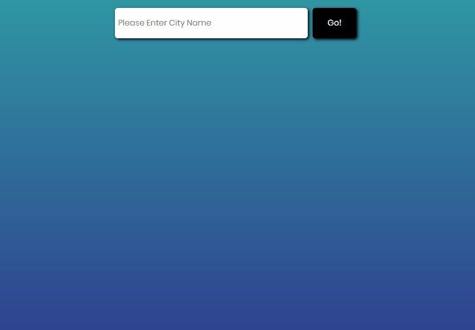

<!--
*** Thanks for checking out this README Template. If you have a suggestion that would
*** make this better, please fork the repo and create a pull request or simply open
*** an issue with the tag "enhancement".
*** Thanks again! Now go create something AMAZING! :D
-->

<!-- PROJECT SHIELDS -->
<!--
*** I'm using markdown "reference style" links for readability.
*** Reference links are enclosed in brackets [ ] instead of parentheses ( ).
*** See the bottom of this document for the declaration of the reference variables
*** for contributors-url, forks-url, etc. This is an optional, concise syntax you may use.
*** https://www.markdownguide.org/basic-syntax/#reference-style-links
-->
[![Contributors][contributors-shield]][contributors-url]
[![Forks][forks-shield]][forks-url]
[![Stargazers][stars-shield]][stars-url]
[![Issues][issues-shield]][issues-url]


<!-- PROJECT LOGO -->
<br />
<p align="center">
  <a href="https://github.com/rammazzoti2000/weather_app">
    
  </a>

  <h3 align="center">JavaScript --> [Weather App]</h3>

  <p align="center">
    This project is part of the Microverse curriculum in JavaScript module!
    <br />
    <a href="https://github.com/rammazzoti2000/weather_app"><strong>Explore the docs »</strong></a>
    <br />
    <br />
    <a href="https://github.com/rammazzoti2000/weather_app/issues">Report Bug</a>
    ·
    <a href="https://github.com/rammazzoti2000/weather_app/issues">Request Feature</a>

  </p>
</p>

<!-- TABLE OF CONTENTS -->
## Table of Contents

* [About the Project](#about-the-project)
  * [Built With](#built-with)
  * [Usage](#usage)
  * [Automated Test](#automated-test)
* [Contributors](#contributors)
* [Acknowledgements](#acknowledgements)
* [License](#license)

<!-- ABOUT THE PROJECT -->
## About The Project

The Weather App project comes at the end of the Asynchronous Javascript and APIs section of the Javascript course. It tests the knowledge of the student about asynchronous communication with promises or async/await and when to use them.

The Weather App allows the user to search for a specific location by typing a city name in the search input.
Initially the temperature will be displayed in Celsius degrees, and by clicking on the temperature it toggles between Celsius and Fahrenheit temperatures.

If the city name does not exist or is misspelled the ES6 Promises will then catch the error and will inform the user about it.

;

### Built With
This project was built using these technologies.
* HTML/CSS
* JavaScript
* WebPack
* ESLint
* StyleLint
* GithubActions :muscle:
* Atom :atom:

<!-- INSTALLATION -->
## Usage

To have this app on your pc, you need to:
* [download](https://github.com/rammazzoti2000/weather_app/archive/develop.zip) or clone this repo:
  - Clone with SSH:
  ```
    git@github.com:rammazzoti2000/weather_app.git
  ```
  - Clone with HTTPS
  ```
    https://github.com/rammazzoti2000/weather_app.git
  ```
  ```$ cd weather_app
     $ npm install
  ```
  - and open `index.html` file from `/dist folder` in the browser

## Automated Test
 > No automated tests yet

## Live Demo

[Live Demo](https://raw.githack.com/rammazzoti2000/weather_app/feature/readme_instructions/dist/index.html) :point_left:

<!-- CONTACT -->
## Contributors

👤 **Alexandru Bangau**

- LinkedIn: [Alexandru Bangau](https://www.linkedin.com/in/alexandru-bangau/)
- GitHub: [@rammazzoti2000](https://github.com/rammazzoti2000)
- E-mail: bangau.alexandru@gmail.com

## :handshake: Contributing

Contributions, issues and feature requests are welcome!

Feel free to check the [issues page](https://github.com/rammazzoti2000/weather_app/issues).

## Show your support

Give a :star: if you like this project!


<!-- ACKNOWLEDGEMENTS -->
## Acknowledgements
* [Microverse](https://www.microverse.org/)
* [The Odin Project](https://www.theodinproject.com/)

<!-- MARKDOWN LINKS & IMAGES -->
<!-- https://www.markdownguide.org/basic-syntax/#reference-style-links -->
[contributors-shield]: https://img.shields.io/github/contributors/rammazzoti2000/weather_app.svg?style=flat-square
[contributors-url]: https://github.com/rammazzoti2000/weather_app/graphs/contributors
[forks-shield]: https://img.shields.io/github/forks/rammazzoti2000/weather_app.svg?style=flat-square
[forks-url]: https://github.com/rammazzoti2000/weather_app/network/members
[stars-shield]: https://img.shields.io/github/stars/rammazzoti2000/weather_app.svg?style=flat-square
[stars-url]: https://github.com/rammazzoti2000/weather_app/stargazers
[issues-shield]: https://img.shields.io/github/issues/rammazzoti2000/weather_app.svg?style=flat-square
[issues-url]: https://github.com/rammazzoti2000/weather_app/issues

## 📝 License

This project is [MIT](https://opensource.org/licenses/MIT) licensed.
